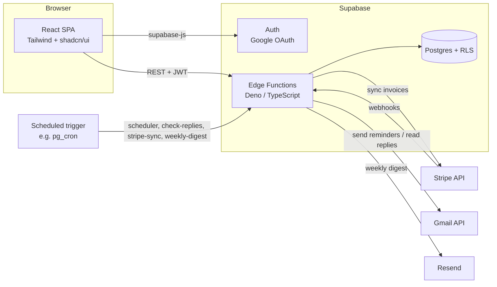

# Collectly

Automated invoice follow-ups for SaaS businesses: sync unpaid invoices from Stripe and chase them with polite reminders sent from your own Gmail.

Collectly is a multi-tenant web app for founders and finance teams who spend too much time chasing late payments. You connect a Stripe account and a Gmail account; Collectly pulls in your open invoices, sends a configurable sequence of reminder emails before and after each due date, pauses the sequence automatically when a customer replies, and stops it once Stripe reports the invoice as paid. Emails come from your own inbox, so replies land in the normal thread and deliverability is better than a no-reply address.

## Features

- **Google sign-in and workspaces** - Supabase Auth with Google OAuth; each user gets a workspace, and all data is isolated per workspace with Postgres Row Level Security.
- **Stripe integration** - connect with a Stripe secret key, sync customers and open invoices, and process `invoice.paid`, `invoice.payment_succeeded`, `invoice.payment_failed` and `invoice.voided` webhooks.
- **Gmail integration** - OAuth connection with `gmail.send` / `gmail.readonly` scopes; reminders are sent as the user and threaded.
- **Reminder policies** - an editable sequence of steps (before due, on due, after due, with day offsets) using templates with placeholders such as `{{customer_name}}`, `{{amount}}` and `{{invoice_url}}`. A default five-step policy is created for each workspace.
- **Autopilot states** - per-invoice state (active, paused on reply, paused manually, stopped on payment, stopped manually) with a per-customer weekly email cap.
- **Reply detection** - checks Gmail threads for customer replies, pauses the reminders and raises a notification.
- **Dashboard and invoice views** - open and past-due totals, invoice list with filters, invoice detail with email timeline and notes.
- **Onboarding wizard** - guided Stripe and Gmail setup with an email preview and test send.
- **Weekly digest** - accounts-receivable summary email via Resend.
- **Health check** - system status endpoint surfaced in the UI.

## Architecture



- **Frontend** (`frontend/`): Create React App (via CRACO) single-page app. It authenticates with Supabase and calls Edge Functions through a small service layer in `src/lib/api.js`.
- **Backend** (`supabase/functions/`): one Edge Function per resource (`invoices`, `policies`, `dashboard`, ...) plus background jobs (`scheduler`, `check-replies`, `stripe-sync`, `weekly-digest`) meant to be invoked on a schedule. Shared Stripe, Gmail, Resend and auth helpers live in `_shared/`.
- **Database** (`supabase/migrations/`): 13 tables covering users, workspaces, integrations, customers, invoices, email events, reminder policies/steps, notifications and onboarding state. A trigger creates a workspace and default policy for each new user.

More detail, including the schema and API reference, is in [docs/ARCHITECTURE.md](docs/ARCHITECTURE.md).

## Tech stack

| Layer | Technology |
|-------|------------|
| Frontend | React 19, React Router 7, Tailwind CSS, shadcn/ui (Radix), Recharts, CRACO |
| Backend | Supabase Edge Functions (Deno, TypeScript) |
| Database | Supabase Postgres with Row Level Security |
| Auth | Supabase Auth (Google OAuth) |
| Integrations | Stripe API, Gmail API, Resend |

## Getting started

### Prerequisites

- Node.js 18+ and npm
- [Supabase CLI](https://supabase.com/docs/guides/cli) and Docker (for the local Supabase stack)
- A Google Cloud OAuth client with the Gmail API enabled
- A Stripe account (test mode is fine)

### Environment variables

Frontend - copy `frontend/.env.example` to `frontend/.env.local`:

| Name | Purpose |
|------|---------|
| `REACT_APP_SUPABASE_URL` | Supabase project URL (`http://localhost:54321` locally) |
| `REACT_APP_SUPABASE_ANON_KEY` | Supabase anon key (public; access is enforced by RLS) |
| `REACT_APP_GOOGLE_CLIENT_ID` | Google OAuth client ID used to start the Gmail connection |

Supabase / Edge Functions - copy `supabase/.env.example` to `supabase/.env` locally, or use `supabase secrets set` in production:

| Name | Purpose |
|------|---------|
| `GOOGLE_CLIENT_ID` | Google OAuth client (sign-in and Gmail token exchange) |
| `GOOGLE_CLIENT_SECRET` | Google OAuth client secret |
| `RESEND_API_KEY` | Resend API key for the weekly digest (optional) |
| `RESEND_FROM_EMAIL` | Sender address for digest emails (optional) |

`SUPABASE_URL`, `SUPABASE_ANON_KEY` and `SUPABASE_SERVICE_ROLE_KEY` are provided to Edge Functions automatically by Supabase.

Each user's Stripe secret key and webhook signing secret are entered in the app's Integrations page, not in environment variables.

### Install and run

```bash
# 1. Start the local Supabase stack and apply migrations
supabase start
supabase db reset          # applies supabase/migrations

# 2. Serve Edge Functions locally
supabase functions serve --env-file supabase/.env

# 3. Run the frontend
cd frontend
npm install
npm start                  # http://localhost:3000
```

Supabase Studio runs at http://localhost:54323.

To receive Stripe webhooks, deploy (or serve) `stripe-webhook` without JWT verification, since Stripe does not send a Supabase JWT:

```bash
supabase functions deploy stripe-webhook --no-verify-jwt
```

The background functions (`scheduler`, `check-replies`, `stripe-sync`, `weekly-digest`) are invoked with a POST request. Schedule them with pg_cron or any external cron; the schedule itself is not part of the migrations yet.

### Build

```bash
cd frontend && npm run build   # outputs frontend/build
```

## Project structure

```
.
├── docs/
│   └── ARCHITECTURE.md          # Schema, API reference, design notes
├── frontend/
│   ├── public/
│   └── src/
│       ├── components/          # Layout, onboarding wizard, status widgets
│       │   └── ui/              # shadcn/ui primitives
│       ├── contexts/            # AuthContext (Supabase session)
│       ├── lib/                 # api.js service layer, Supabase client, helpers
│       ├── pages/               # Dashboard, Invoices, InvoiceDetail, Integrations,
│       │                        # ReminderPolicy, Settings, WorkspaceSetup, Landing
│       └── App.js               # Routes and protected-route wrapper
├── supabase/
│   ├── config.toml              # Local Supabase configuration
│   ├── migrations/              # SQL schema, RLS policies, triggers
│   └── functions/
│       ├── _shared/             # CORS, Supabase, Stripe, Gmail, Resend helpers
│       ├── scheduler/           # Sends due reminders
│       ├── check-replies/       # Detects customer replies in Gmail
│       ├── stripe-sync/         # Pulls customers and invoices from Stripe
│       ├── stripe-webhook/      # Handles Stripe invoice events
│       ├── weekly-digest/       # A/R summary email
│       └── ...                  # invoices, policies, dashboard, integrations, etc.
└── .cursor/skills/              # Cursor agent instructions used during development
```

## Status

Working MVP, in active development; not deployed publicly. Core flows (sign-in, Stripe and Gmail connection, invoice sync, reminder sending, reply detection) are implemented. Known gaps before production:

- Stripe keys and Gmail OAuth tokens are stored in plain table columns; moving them to Supabase Vault is planned.
- The Stripe webhook falls back to processing unsigned payloads for local development; this must be removed before production.
- CORS allows all origins.
- Cron schedules for the background functions are not yet defined in migrations.
- No automated tests yet; the frontend is still JavaScript (TypeScript migration planned).

## License

No license has been chosen yet; all rights reserved by the author.
